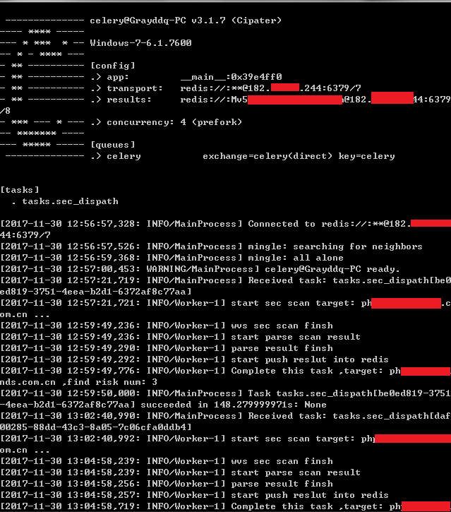
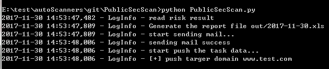
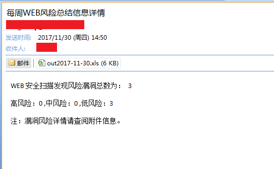
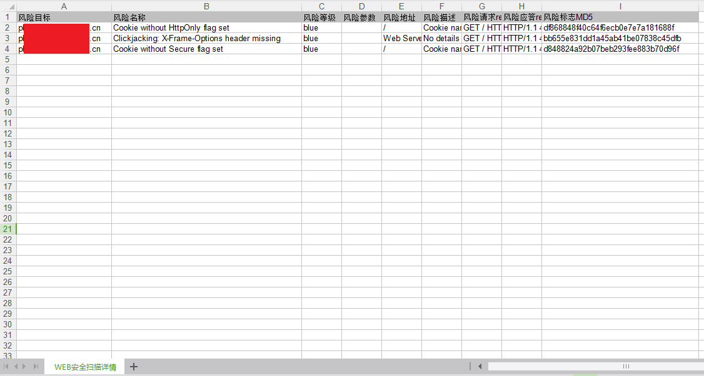

# PublicSecScan 0.1

这个脚本的主要目标是针对大量WEB资产进行分布式WEB安全扫描，发现web环境下常规的一些安全漏洞。

## Author ##

咚咚呛 

如有其他建议，可联系微信280495355

## Support ##

满足如下安全需求

	1、对大量WEB资产(如域名和IP http服务)进行分布式安全扫描
	2、周期时间(如每周)总结WEB环境下还存在哪些常见的安全漏洞
	3、输出所有结果到excel，并发送Email通知

技术细节如下：

	1、分布式采用Celery + Redis结构
	2、Worker调用AWVS Console进行WEB扫描
	3、扫描结果以KV数据存储到Redis中
	4、每个漏洞有效期为7天，过期删除；当再次扫描到此漏洞时，重置漏洞有效期
	5、发送所有结果到email

## Test Environment ##

>Windows 7 旗舰版
>
>python 2.7.5
>
>AWVS 10.5

## Tree ##

	PublicSecScan
	----lib                #模块库文件
	----log                #日志目录
	----out    	           #输出目录
	----tasks.py   		   #分布式调度任务
	----domain.txt		   #域名或IP列表
	----PublicSecScan.py   #任务分发主程序

## Deploy ##
	
	部署分为两块，一个任务发布Server、一个扫描任务执行Worker

	1、任意机子安装redis
	$ yum install redis
	$ vim /etc/redis.conf
	# 更改bind 127.0.0.1 改成了 bind 0.0.0.0
	# 添加一行requirepass xxxxx密码
	# 修改daemonize yes
	$ redis-server /etc/redis.conf
	
	2、Worker部署(WIN机子多多益善)
	1） 安装AWVS
	2） pip install -r requirements.txt
	3） 配置./lib/config.py 文件，填入Redis和WVS相关信息，Email信息可忽略
	4） cmd代码目录执行，-c 1代表多一个WVS进程，可增加：
	celery -A tasks worker -c 1 --loglevel=info -Ofair
	
	3、Server部署(部署一台机子)
	1） pip install -r requirements.txt
	2） 配置./lib/config.py 文件，填入Redis和Email(可选)相关信息，wvs信息可忽略
	3） domain.txt中填入待扫描信息，可随时更新
	4） 执行python PublicSecScan.py

## Config ##

配置目录：./conf/info.conf

	REDIS_HOST = '111.111.11.111'
	REDIS_PORT = 6379
	REDIS_PASSWORD = 'xxxx'
	REDIS_DB = 1
	
	# wvs安装位置,目录有空格记着用双引号括住
	wvs_location = 'C:/"Program Files (x86)"/Acunetix/"Web Vulnerability Scanner 10"/'
	# 风险入库后有效期，过期自动删除，单位秒；
	risk_timeout = 604800
	
	# 邮箱信息,不填写则代表不发送邮件，结果保存在out/目录中
	email_user = 'xxxxx@163.com'
	email_pass = 'xxxxx'
	target_email = 'xxxx@qq.com'
	smtp_server = 'smtp.163.com'

## Worker Screenshot ##

## Server Screenshot ##

## output ##

输出目录默认：./out/

